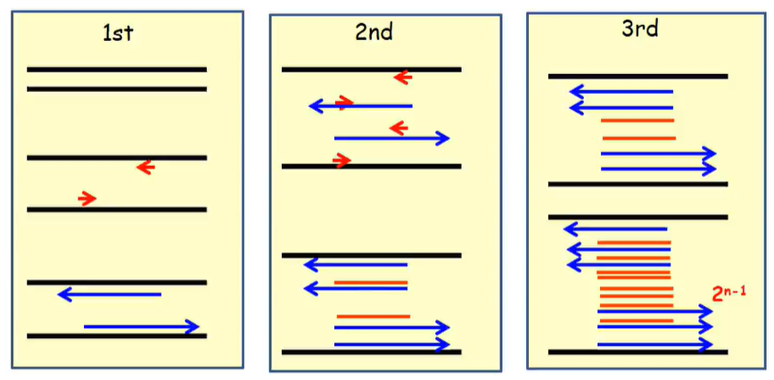
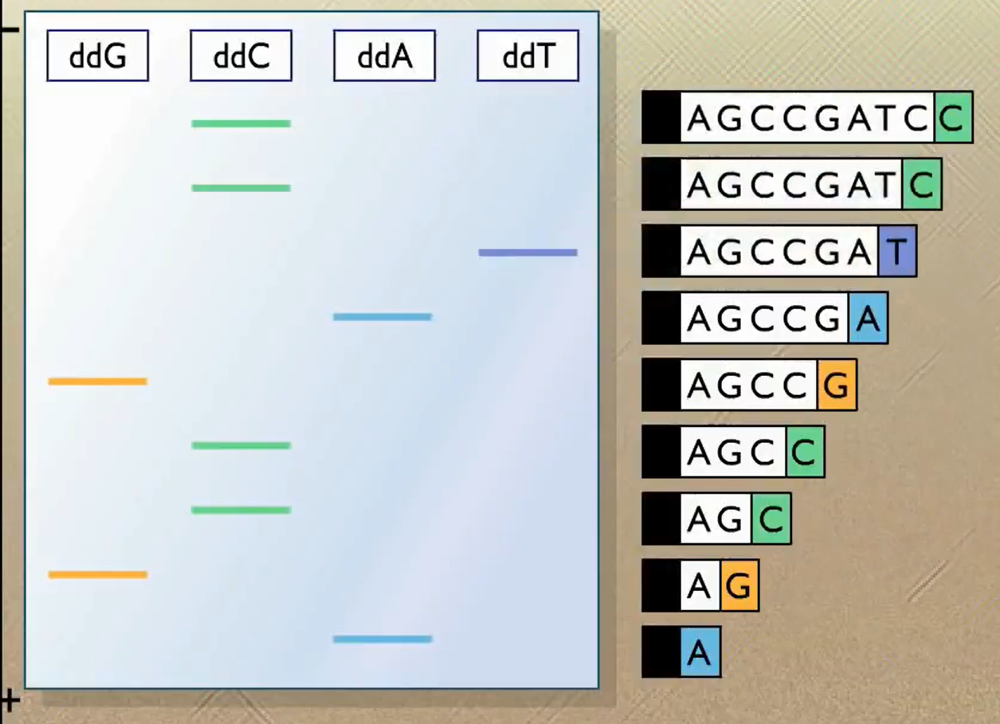
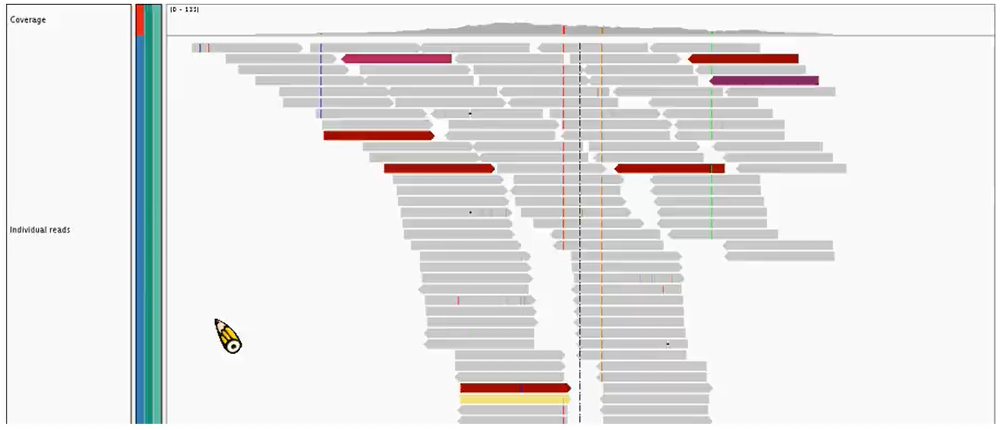

# 分子育種 (Molecular Breeding)

什麼是育種：改變或改良作物的遺傳質

什麼是生物技術：利用**生物程序**、**生物細胞**或其代謝物質來製造產品及改進人類生活素質的科學技術

## 遺傳質

遺傳質：DNA 為遺傳的基本物質

Genome: 基因體 = 細胞內所有可以遺傳的 DNA

Chromosome: 染色體 = DNA + 組蛋白(histone)

> 一對染色體上如果兩條帶的基因相同如 AA 稱 homozygous (同質)，若兩邊帶的基因不同如 Aa 稱 heterozygous (異質)

DNA 成對出現 A 配對 T，C 配對 G

> 5' T C T G C A G T G C A A 3'
>
> 3' A G A C G T C A C C T T 5'

因為 DNA 是由 5' 端開始做複製，所以讀的時候一律從 5' 端開始讀到 3' 端

### Central Dogmas

Central Dogmas 中心法則指的就是 DNA→RNA→protein (每個生物都一樣所以叫中心法則)

#### Transcription: DNA→RNA

DNA

+ sense: A C C G T G C G C
+ antisense: T G G C A C G C G

RNA

+ A C C G U G C G C

#### Translation: RNA → Protein

每三個 RNA 轉成特定的胺基酸

## 如何改變遺傳質

### 突變 (mutation)

1. 染色體或基因突變 (缺失、重複、逆位、轉座)
2. 整條染色體之變化，為非整倍多倍體
3. 全套染色體之變化 (單倍體、多倍體)

DNA 改變不太會造成外觀的改變，每天吃的米飯都有很多都突變了。另外，基因突變也不一定會改變胺基酸序列

但也不一定每次都不變，人體中常常會因為一個點突變(SNP: single-nucleotide polymorphisms)而發病

### 天然突變 (spontaneous mutation)

+ 自然突變在特定基因座上，10萬分之1 到 100萬分之 1，有害突變多於有益突變
+ 天然突變頻率過小，有利育種的更是可遇不可求
+ 無性繁常利用芽條變異 (sport)
+ 蔬菜常用自然體細胞突變來育成商業品種

### 誘發突變 (induced mutation)

+ 因為自然突變機率太低
+ 用放射線照射芽體
+ 比如 UV 會打斷 DNA，而細胞修復時可能修復錯誤而突變
+ 也可以抹 EMS：會讓 G → A (一次處理可以產生幾千處突變)
+ 利用誘發突變可以產生自然界未發現的新性狀
+ 突變育種要有大量族群做選拔，而且能直接利用的品種也很少
+ 外表型 = 基因型 + 環境因子 (P = G + E)

 ### 特異性 (Specificity)

基因的表現有「組織特異性」和「時間特異性」

雖然基因都一樣但要不要表現是決定於啟動子 (promoter) 的序列

## 分子育種方法

+ 分子標誌輔助育種 (marker-assisted selection)
+ 基因轉殖 (gene transformation)
+ 基因編輯 (genome editing)

## PCR

polymerase chain reaction (聚合酵素連鎖反應): 利用酵素對特定基因做體外或試管內 (in vitro) 的大量合成

PCR cycle:

1. 變性 denaturation: 加熱到 90°C分開兩股
2. 煉合 annealing: 加入引子 (primer) 並於 40°C\~ 60°C 與單股 DNA 結合
3. 延伸 extension: 加入 DNA polymerase 酵素，在 70°C 合成 DNA

重複 30 次，做出 10 億條

> + DNA polymerase (DNA聚合酶)也是一種蛋白質，在 90°C 很容易失去活性，因此，要選用特別的 DNA polymerase，這是在溫泉裡的細菌找的
> + PCR 的技術可以讓我們在體外大量複製 DNA，在此之前我們只能透過生物來做複製

## 洋菜膠電泳

DNA 有磷酸，帶負電。接著把DNA放進去一端通正電一端通負電，洋菜膠之間有很多孔細，透過 DNA 最後停留的位置去推測他所帶有鹼基的數量

## Sanger Sequence

在複製時加入 ddG, ddC, ddA, ddT

ddG 複製出來的結尾只有 G, ddC 複製出來結尾只有 C, ... 依此類推

接著透過電泳的方法去跑，因為製作出來的鹼基數目不一樣，所以可以依此回推 DNA 鹼基的排列順序

但是，實際做出來非常困難，因為只差一個鹼基，所以跑的時候很容易跑壞，可能會跑到一樣的位置無法分辨長短

後來因為太難跑所以又加上了螢光，讓ddG, ddC, ddA, ddT染上不同的顏色，再讓機器自己去讀

## Next Generation Sequence (次世代定序)

比傳統方法還快還便宜

1. 切 DNA 片斷，頭尾標定
2. 黏在晶片上，然後做複製
3. 再用雷射光去做掃瞄
4. 最後透過電腦去拼出完整的序列

## DNA recombination

### restriction enzyme 限制酶

 在不同細菌內發現不同的限制酶

限制酶命名

*Eco*RI

E = genus *Escherichia* (屬名第一字母 斜體)

co = species coli (種名前兩個字母 斜體)

R = strain Ry13 (品系 正體)

I = first enzyme isolated (第一個找到的 酵素 正體)

### DNA ligation (DNA 連接酶)

可以把兩條 DNA 黏合成一條

### 細菌質體 (plasmid)

質體 DNA (plasmid) 存在於細菌或酵母中，獨立於 DNA 之外的環狀 DNA 小分子。Plasmid 可不依賴染色體而獨立進行複製

1. 植物目標基因用限制酶剪裁
2. 選用有抗藥性的質體並用限制酶剪裁
3. 用連接酶把兩個黏合
4. 將殖體植入細菌並透過細菌大量複製
5. 用抗生素把沒有帶到質體的細菌殺死

---

## 作業

A 基因 DNA 序列 A T G C A T T G C C G A A T G C C A A T A G G C

1. sense: 5' A T G C A T T G C C G A A T G C C A A T A G G C 3'

2. anti-sense: 3' T A C G T A A C G G C T T A C G G T T A T C C G 5'

   > 應該要反過來寫
   >
   > 5' G C C T A T T G G C A T T C G G C A A T G C A T 3'

3. RNA:  A U G C A U U G C C G A A U G C C A A U A G G C

4. Protein: 啟動子 - His - Cys - Arg - 啟動子 - Pro - Ile - Gly