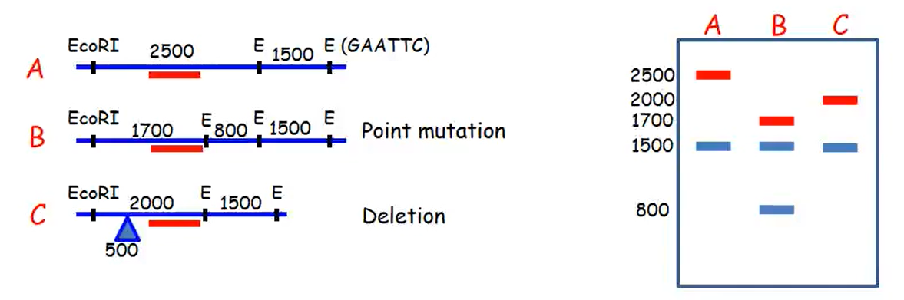
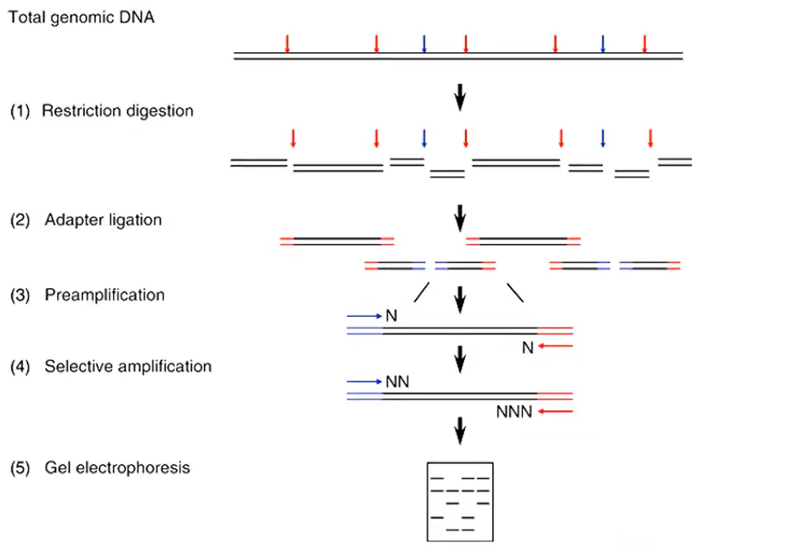
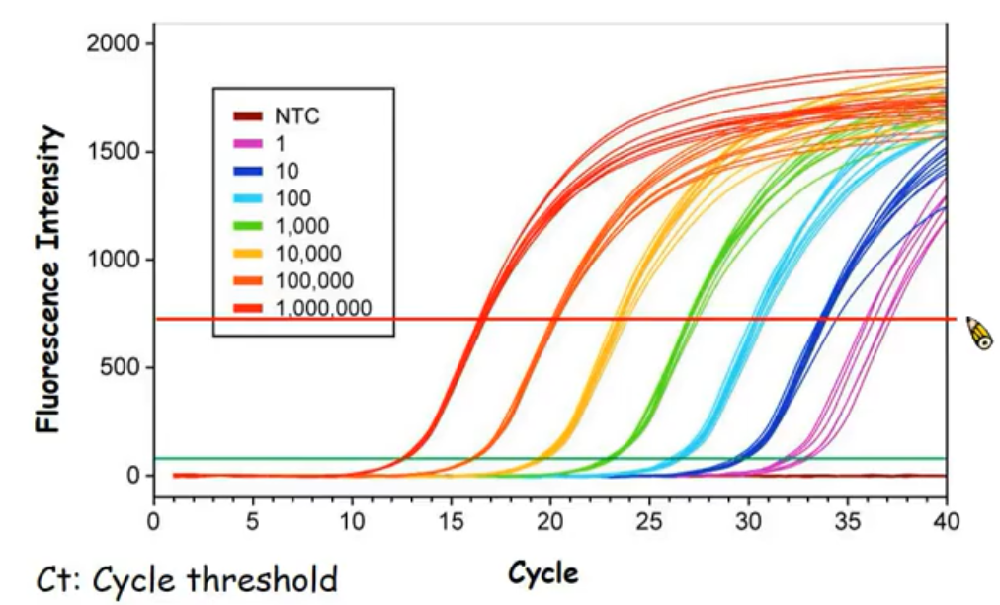
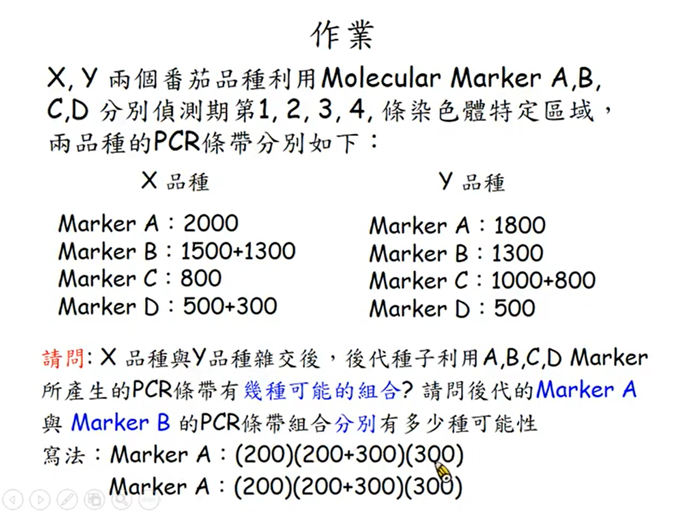

# 分子標記輔助育種

[TOC]

傳統的育種在做挑選時，會耗費很多時間，透過分子標記的方法可以減少挑選的時間。

主要為以下三個步驟：

1. 找到分子標誌 (NGS 次世代定序、探針、PCR)
2. 連結分子標誌與性狀 (Bioinformation 生物資訊，靠電腦去找)
3. 分子標記輔助育種

## STEP1: 找到分子標誌 (Molecular Marker)

DNA 分子層次上經由標準操作程序來反應生物個體間或種群間**具有差異的 DNA 分子片段**

簡單來說就是要找出兩個品種間的基因差異，可以分為三種方式：

1. 利用探針
2. 利用 PCR
3. 以重複序列為基礎的分子標誌

### RFLP

Restriction fragment length polymorphism (限制性片段長度多型性)

根據各品種 Genomic DNA 切開後分布狀態不同，產生的 DNA 片段長度的多型性 (polymorphism)，分析品種間的歧異度

1. 抽取 DNA 

2. 用限制酶切

3. 跑電泳

4. 將膠體的 DNA 轉漬到濾膜上，又稱**南方墨點分析法(Southern blot)**

   由上到下分別為 膠體→濾膜→底下抽氣
   這樣膠體上的 DNA 就會被抽到濾膜上

5. 利用不同染色體片段標示螢光做為探針

6. 探針與轉漬膜上 DNA 互補結合

7. 螢光顯現 DNA 片段長度之多形性

透過探針可以知道不同基因多型性

### VNTR

Varied number of tandem repeat (可變數目串聯重複)

利用基因指紋 (finger print) 的方式來做人類親子鑑定。基因指紋就是染色體上某一段由重複幾個鹼基組成而成的比如像 ATCATCATCATC (ATC 重複 4 次)這樣，透過子代的基因指紋可以鑑定其親源，因為子代一對染色體中有一條來自爸爸，另一條來自媽媽。雖然某一段基因指紋可能會有重複的可能，但實際上在比對時，會比對好幾段，來減少重複的機率。

放一張維基找的圖：

### RAPD

Randomly amplified polymorphic DNA

在我們不清礎某物種的基因序列的情況下，我們可以隨機以 8~10個鹼基為 Primer，來做 PCR

兩個品種跑出來的片段會不太一樣，透過比較兩個品種跑出來的不同片段來研究其親源關係。實際做的時候會用會好幾個 primers 來做，並綜合結果來畫出親源關係圖。

RAPD 的特色是我們不需要知道基因序列，而且只要少量 DNA，操作容易(僅需跑PCR，不需用到探針)又便宜。但RAPD 也有缺點，因為與模版的黏合溫度較低，容易出現鹼基錯配，因此可能對同一個基因做兩次跑出來結果不一樣。

### AFLP

Amplified fragment length polymorphism

有點類似 RAPD，AFLP 會先用限制酶切片段，並在片斷上加入特定的 adapter，並根據這些 adapter 設計 primer，最後再做 PCR。這個方法可以有效解決 RAPD 每次測出來結果都不太一樣的問題

### SSR

Simple sequence repeat (簡單重複序列)

+ 又稱為微衛星 DNA (microsatellite DNA)
+ SSR重複單元的數目存在高度變異，而 SSR 付近的序列(側翼)則保守性較強，較不會有變異
+ 透過 SSR 側翼的 DNA 來設計 primer ，並利用 PCR 增幅 SSR 片段
+ 因為 SSR 重複單元變異度高，所以 PCR 長度變化也就會比較多

優點：SSR 標記數量豐富，覆蓋整個基因組，揭示的多態性高。目前遺傳研究最廣泛使用的分子標誌之一。

缺點：要先知道 SSR 的側翼基因才能設計 Primer

### ISSR

Inter-SSR

SSR 在 DNA 上分佈不平均，兩 SSR 中間之片斷稱為 Inter-SSR (ISSR)，利用 PCR 分析 ISSR 的大小與序列，也可以作為分子標誌

## STEP2: 連結分子標誌與性狀/品種

透過第一步驟的分子標誌，去尋找哪個標誌對應哪個品種。

1. Target locus selection (選有目標基因的後代留著，沒有的就丟掉)
2. Recombinant selection

舉印度和孟加拉大洪水導致稻米死亡為例，欲培育出「耐淹水水稻」

Swarna: 商業品種，但不耐淹水

Sub1: 野生品種，產量低口感差，耐淹水

透過分子標誌知道 Sub1 在第9條染色體的某個區段可以導致其能耐淹水

傳統的作品是透過回交法，一一篩選，需要先經過淹水才篩選，再試吃其口感，該種作法相當複雜，而且可能要回交七到八代。若能知道是哪段基因導致稻米能耐淹水，則可以在篩選時直接透過其基因型來做挑選。不必再一一嘗試其耐淹水能力和口感、產量、抗病性等。

利用分子標誌育種，育種時間由 8 年縮短至 5 年！

## STEP3: 分子標記輔助育種 (MAS 的育種優勢)

MAS: Marker-assisted Selection

1. 用基因型篩選不會受性狀影響
   傳統上用表現型去回推基因，很有可能會因環境的影響而篩錯
2. 可篩選多基因控制之性狀，並確定多基因表現之強度。並且可同時篩選不同之目標性狀
3. 可篩選困難判定之性狀，如抗蟲抗病。也可以不受時空、地域限制，甚至能比傳統方法更早就做篩選
   只要用基因型看就行了，傳統方法要用表現型觀察，很難直接做篩選，會誤判。另外有些要篩選花色的育種，傳統方法要等花開了才能做篩選，如果用 MAS ，比對一下基因型，不用等開花就能篩選了
4. 傳統育種中，需再進行一次自交才可確認原品系是否帶有隱性基因影響子代，MAS 可直接確認。

## 後基因體時代 (post-genomic era)

+ QTL(quantitative trait locus): 數量性狀基因座定位

+ SNP (Single Nucleotide Polymorphism): 由單個核苷酸鹼基 (A,T,C,G) 的變異引起 DNA 序列的改變

+ GWAS (Genome-wide association studies): 全基因體關聯分析：在全基因組內找出存在的序列變異與外表型的相關性之技術
  Phenotype analysis (實際觀察) → Genotype analysis (生物技術 NGS 次世代定序) → Association analysis (電腦) → Gene discovery

  > GWAS 可以鑑定出很多影響微量性狀之基因

## 武漢肺炎 qPCR 檢測原理

qPCR (quantitative real-time PCR)

PCR 要複製 30 次才看結果，qPCR 在一開始時就先做螢光染色，透過儃次複製後觀察螢光的量可以知道有病毒的基因所佔有的量。如果病毒量較多，那麼在複製早期就有比較高的螢光訊號，反知若要複製比較多次，則病毒量極少。

在台灣，CT 值在 35以下代表有傳染力，35 以上則幾乎沒有傳染力，採合三次採檢可以確定陰性

## 作業

X 品種的配子有  $1\times2\times1\times2 = 4$ 種

Y 品種的配子有 $1\times1\times2\times1=2$ 種

PCR 條帶有 $4\times2=8$ 種可能

後代 Marker A: (2000+1800)

後代 Marker B: (1500+1300)(1300)