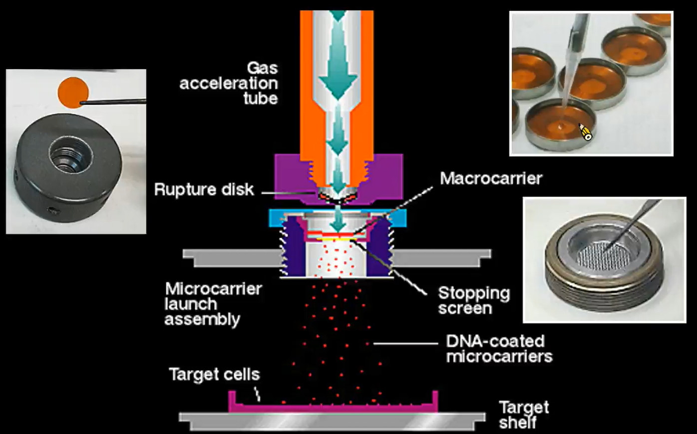

# 基因轉殖

> 植物基因轉殖是將外來基因送入植物細胞，並嵌入植物細胞的染色體或胞器的基因組內，並且，此基因可正常的表現並穩定的遺傳至後代

基因轉殖的其中一個應用是用來做基因的研究。分子標記輔助育種需要知道哪段基因對應哪些表現。這時基因轉殖就可以幫忙做到這件事情，可以用兩種方法實現：

1. 加法的方法：比如在稻米上假設有一段基因 sub1 它是耐淹水的，那麼我們可以把他轉殖到不耐淹水的稻米上，並觀察該轉殖後的稻米耐不耐淹水就可以知道我們的假設是否成立
2. 減法的方法：另一種方法是把帶有 sub1 基因的稻米的 sub1 基因無效化，再觀察，即可驗證我們的假設

## Gene gun transformation

基因槍：將 DNA 放入子彈內再打入細胞核內，目前會以「金粒子」來當子彈，穩定又不會傷害細胞。早期是用火藥當動力，後來經改良，改以氦氣做為子彈的動力

## Agrobacterium tumefaciens pathogen 農桿菌

農桿菌是一種可以感染 60% 植物的 plant pathogen (植物病原體)，農桿菌可以把自己的基因轉殖進植物裡面。

農桿菌的生存需要 Opine ，農桿菌本身並不會生產，而是只帶有生產該物質的基因。因此農桿菌會將能生合成 Opine 的基因送入植物，並讓植物幫他製造 Opine

農桿菌會將 Ti plasmid 中的 T-DNA 轉入至植物內，T-DNA 的序列為 LB-auxin-cytokinin-opine-RB 其中 LB (left border), RB (right border) 是 T-DNA 的邊界，農桿菌會透過這個邊界來辨識 T-DNA，其中 Auxin 可以促進發根，Cytokinin 可以促進長芽，若兩者同時作用，就會造成植物有腫瘤狀的凸起。

透過農桿菌的這種特性，我們只要將目標基因嵌入至 Left border 和 Right border 之間，就可以讓農桿菌幫我們做基因轉殖。

另外，不是所有農桿菌都有 Ti plasmid，有些只有 Ri plasmid，只有前者會造成植物長瘤

## 提高轉殖成功率

在轉殖的 TDNA 中大概只有千分之一的細胞能成功轉殖。為了讓有成功轉殖的細胞繁衍並抑制其他沒有轉殖的細胞，我們可以在目標基因中加入抗抗生素的基因，再利用抗生素把沒被轉殖的細胞篩選掉。

## RNAi (RNA interfering) 干擾 RNA

如何干擾 RNA：利用與目標基因互補的 RNA 來抑制。將 Anti-RNA 轉入基因內，因為 RNA 和 Anti-RNA 會互補而形成「雙股 RNA」。對細胞來說「雙股 RNA」 是一種不正常的東西，細胞會把他清除，利用這種方法可以達到抑制特定 DNA 片段的效果

## 蘇力菌

蘇力菌殺蟲結晶蛋白，在蟲子鹼性的腸子中會分解出有毒的蛋白結構，並能針對特定蟲子的腸子上的專一接受器(Acceptor)活化，導致腸穿孔，蟲子死亡。

該結晶毒白具有專一性的殺蟲效果，對目標昆蟲外的生物完全無傷害。因此，有機種植仍能使用該結晶蛋白，但是直接施用結晶蛋白，效果並不好，因為，其在環境中會降解，因此人類利用基因轉殖的方法，轉殖出具有抗蟲害的植物。比如：玉米

玉米若使用結晶蛋白或傳統農藥除蟲效果都不會，因為玉米外面都有葉包覆著，無法直接防止蟲吃玉米粒。

## 嘉磷塞原理

嘉磷塞可以抑制 EPSP 生成，這可以讓植物因無法合成 EPSP 而無法生長，這種蛋白在動物中是沒有的。

科學在農桿菌中發現 CP4 EPSP 的基因，這種基因可以使 EPSP 不被嘉磷塞阻檔，也因此可以將作物轉殖 CP4 EPSP，這樣就可以直接對著作物灑殺草劑，也不怕作物跟雜草一起被除草劑除掉

## 比較

|                | 傳統雜交                 | 分子標誌 MAS             | GMO                |
| -------------- | ------------------------ | ------------------------ | ------------------ |
| 變異來源       | 找尋天然突變株或人為突變 | 找尋天然突變株或人為突變 | 尋找目標基因       |
| 育種方法       | 雜交育種                 | 雜交育種+分子標誌        | 基因轉殖           |
| 誘發突變       | 860-4300                 | 860-4300                 | 一段 DNA           |
| DNA改變位置    | 未知                     | 未知                     | 已知               |
| 基因改變數量   | 未知                     | 未知                     | 已知(但懷擬有未知) |
| 蛋白質改變數量 | 未知                     | 未知                     | 已知(但懷疑有未知) |

**MAS v.s. GMO**

1. MAS 雜交時必需要與真的帶有該性狀之同種作物雜交，GM 則不需要，GM 可以跨種，只要有基因就好
2. MAS 必需要預先知道 Genetic resource 必需要知道哪裡有 molecular marker
3. MAS 必需是有性繁殖，而 GM 即使是無性繁殖也能更改

