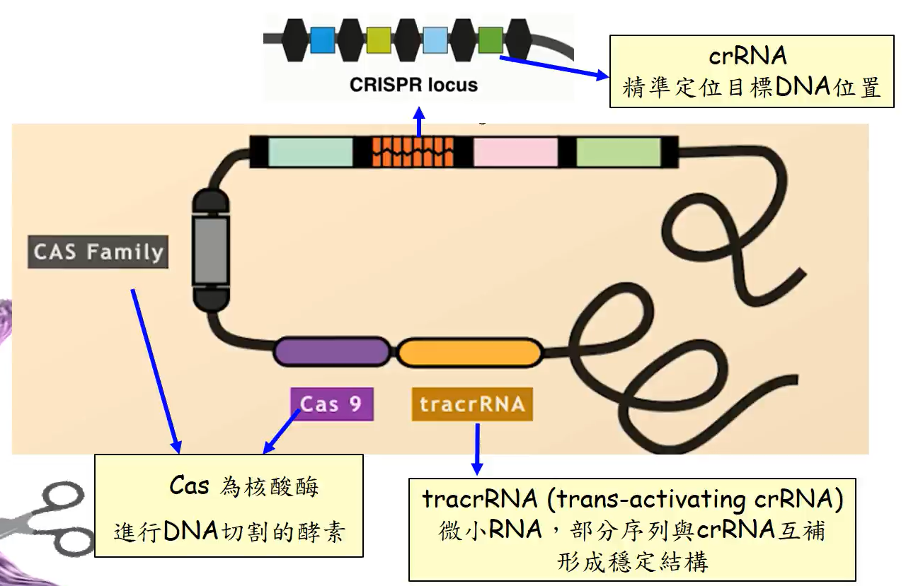
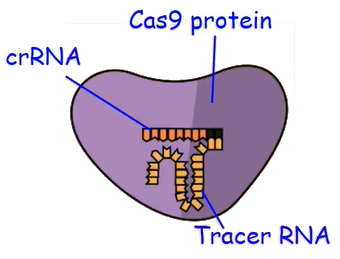

# 基因編輯 CRISPR/Cas9

基因轉殖使用 tDNA 時只能隨機插入，並不能指定要插在哪一條上。CRISPR 是一種近年來簡單又便宜的基因編輯的方法

CRISPR = clustered regularly interspaced short palindromic repeats

Cas9 則是一種經常搭配使用的基因

## CRISPR 原理

CRISPR 是一段在細菌中找到的基因

可以簡單分為兩個部分，黑色的部分稱為 repeat ，而中間有顏色的部分稱為 spacer，當細菌遭受噬菌體攻擊時，就會把噬菌體的基因加入 spacer 中，產生免疫，等下一次同一種噬菌體攻擊時，細菌能辨識出來並瓦解外來的基因

若噬菌體再次來襲並放出他的 DNA時，細菌會讓每一個 spacer 都產生一段 RNA (crRNA)，tracrDNA 也做出 tracrRNA，此時 crRNA 能與 tracrRNA 結合形成 Guide RNA (gRNA)，並且與 Cas9 所產生的 Cas Protein 結合

該結構可以切開噬菌體的基因，剪斷的位置在 `NGG` 上游的第3到第4個鹼基之間 (N 代表 A T C G 其中一個)，剪斷後在修覆的過程會造成突變，可以分成三種

1. Heterozygous mutation (其中一股變異，使其與另一股不同)
2. Homozygous mutation (兩股皆有變異，且變異的地方一樣)
3. Biallelic mutation (兩股皆有變異，且變異的地方不一樣)

## CRISPR 應用

### 醫學領域

**遺傳性疾病**

1. 透過 CRISPR/Cas9 編輯胎兒血紅素避免地中海貧血

**病毒感染疾病**

1. 利用 CRISPR 標靶作用於鼻咽癌病毒上
2. 治療 AIDS，成功剔除 HIV 病毒
3. 利用 CRISPR 標靶作用於 B 型肝炎病毒上

**神經退化疾病**

1. 帕金森氏症
2. 阿茲海默症

**癌症**

1. 肝癌、乳癌

### 農業領域

基因編輯在園藝作物之應用

| 優點                                                         | 缺點                                                         |
| ------------------------------------------------------------ | ------------------------------------------------------------ |
| 1. 操作簡單 2. 專一性高 3. 可生產無外來 DNA 的基因編輯作物 4. 可直接編輯商業品種，育種效率高 5. 打破基因連鎖效應 | 1. 不同品種組織培養難度不一 2.  基因轉殖系統不完全 3. 園藝作物多倍體 (需要同時編輯好幾條) 4. 基因體序列資料不足 5. 幼年性長 (所有育種的通病) |

**CRISPR 系統建立 (PDS基因)**

要基因編輯一個新的園藝作物時，常常會先利用 PDS 基因來做測試，PDS 是類胡蘿蔔素生合成路徑，破壞該基因可以間接導致植物中的葉綠體壞死(方便觀察)。透過這個方式可以知道是否有成功編輯基因

**丹參**

具有抗心血管疾病、抗菌、抗癌的功能，其基因中有 11段 RAS 基因，透過基因編輯的方法可以確認哪一段才是真正有影響的基因

**玉米**

透過基因編輯讓玉米能產生支鏈澱粉，支鏈澱粉可以用在工業中當穩定劑

**抗病育種 (細菌)**

植物會抗病的原因：原先的植物因某些基因容易染病。突變株能抗病的原因是因其突變恰好在容易染病的基因上。因此透過破壞容易染病的基因，可以培育出抗病品種

**抗病毒育種**

病毒進入植物體內需要 eIF4E (真核轉譯起因子4E) 才能產生病毒所要的蛋白質，透過破壞該蛋白質可以育成廣效性的抗病毒品種上

**單為結果**

蕃茄的 SAGL6 基因，會讓沒有受精的不能著果，透過破壞該基因可以讓蕃茄單為結果

**採後處理**

利用基因編輯讓洋菇 PPO 酵素減少，使其褐化速度減緩