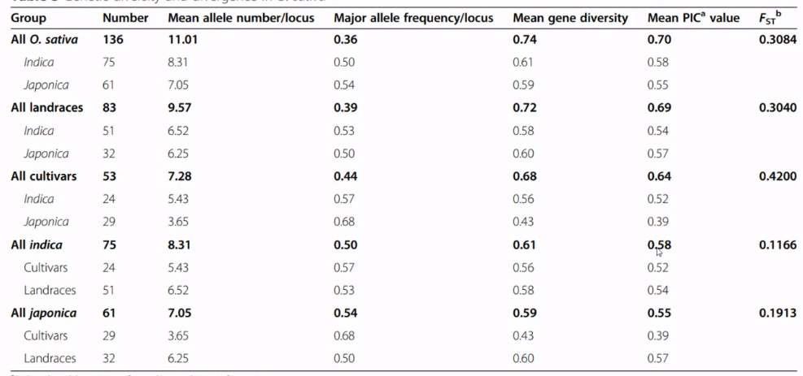
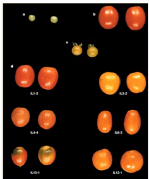
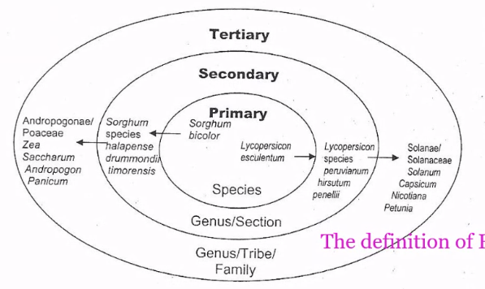

# To Leverage Plant Genetic Resources for Plant Science Research and Crop Improvement

## 植物遺傳資源的重要性

氣候變遷→影響生物多樣性

人工育出的品種基因多樣性比較差，也比較無法適應極端氣候，但其實很多野生種是有抗性的，也因此生物多樣性特別的重要。

簡單來說，要有種原，才好育種，因此保留植物資源，是一個重要的課題

## 植物 v.s. 作物

作物 = 具有經濟價值的植物 (產量、果實大小、同時採收 ... 等)

我們的作物也都是從植物馴化過來的，馴化後會有瓶頸效應，經過人類選拔後的作物，其基因池跟野生作物的基因池比起來會小很多。也因此現代在做育種時就可能需要去他的野生近緣種去找

### 種質資源 (Classical germplasm)

由上至下遺傳歧異度增加

1. Commercial cultivars (商業品種)
2. Advanced breeding lines (進階育種，比如原商業品種與抗病性的野生種一起培育)
3. Landraces or traditional / primitive cultivars (地方種，適應當地的環境)
4. wild and weedy species related to cultivated species (近緣野生種)
5. special genetic stocks (有特殊的基因，比如置換過的)
6. co-adapted or symbiotic organism (有一些共生的微生物)

## Advanced breeding lines

**水稻白葉枯病**

+ 興大 9 號 (輪迴親: 台稉 9 號；提供親：具有IRBB66、IRBB62的國際品種)

+ 興大 11 號 (輪迴親：台南 11 號；提供親：具有IRBB66的國際品種)

## Landraces

地方種，台灣不同地區的小米就都長得不一樣 (有的黑有的褐)

+ 要找到高度歧異的基因，就是去起源地找
+ 野生種(landrace)的歧異度會比栽培種高
+ 歧異度可以用 PIC value 來看

## The concept of gene pools

第一個圈是同種的，第二個圈是與近源野生種雜交，第三個圈則是用到同科不同屬的作物

## 如何保存種源？

1. 原地保存 (in situ conservation)
   + 優點：可以跟著環境變遷一直保存
   + 缺點：比較難保存、管理
   + 舉例：祕魯的馬鈴薯
2. 移地保存 (ex situ conservation)
   + 種子 (有些不能用種子 ex. 地瓜)
   + 組織培養 (貴)
   + 優點：保存容易
   + 缺點：沒有辦法跟著環境一直變遷、有基因漂變的問題
