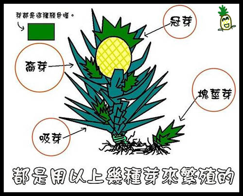
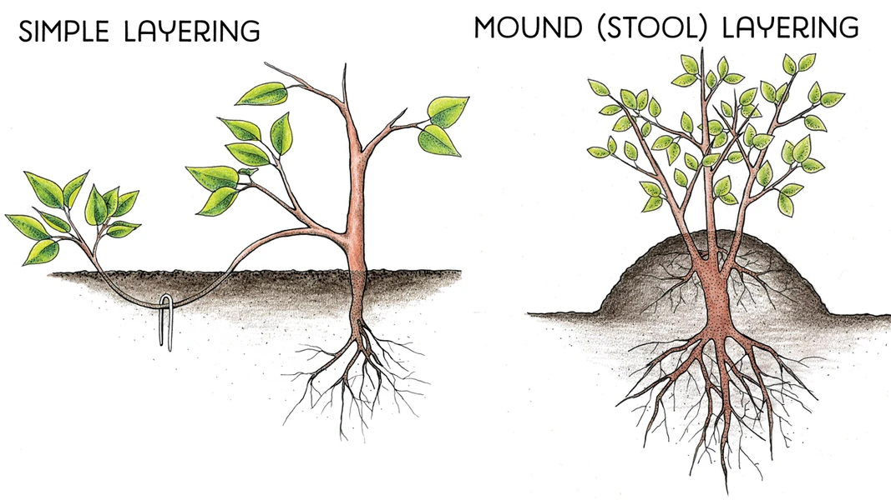

# 植物繁殖

## 種子繁殖

> 種子必定在花朵內產生。種子形成前細胞經過減數分裂(meiosis)，生成染色體(chromosomes)數減半的精細胞(sperm cell)與卵(egg)。卵與精細胞在胚珠(ovule)中結合、受精(fertilization)後形成合子(zygote)，之後發育成胚(embryo)

### 種子生產 (seed production)

謹慎控制種子來源可防止花粉污染而降低遺傳純度(genetic purity)

美國許多洲以及其他國家皆已設立種子檢定計畫(seed certification program)以保護並維持品種的遺傳純度，如：大豆、小麥、燕麥、紫花與紅花苜蓿

### 種子構成 (seed fomation)

1. 胚 (embryo)：可生長新植株

2. 養份貯藏原料：可供應胚性植物養份。此部分由胚乳(endosperm)組織或子葉(cotyledons)組成

3. 種子包覆物：通常為兩層種皮(seed coats)，但也可能包含一部份子房壁(ovary wall)

> 子房(ovary)→果實(fruit)
> 
> 胚株(ovary)→種子
> 
> 珠被(integuments)→兩層種皮
> 
> 珠心(nucellus)→外胚乳(perisperm)(2n) 通常退化
> 
> 2極核 (polar nuclei) + 1精核 → 胚乳(endosperm, 三倍體 triploid 2n+n)
> 
> 卵 + 1精核→合子→胚(embryo, 二倍體 diploid n+n)
> 
> 
> 
> 

### 種子貯藏 (seed storage)

> 柳、楓與榆樹種子胚壽命僅數天至數月，硬實豆類種子則長達樹年。一般植物種子胚壽命則依貯藏環境而異
> 
> 種子在密閉容器內低溫冷藏 0\~4°C且低溼度(15%，種子濕度為47%)環境，<u>其活力壽命長於貯室溫且高濕環境</u>
> 
> 將柑橘屬、楓、橡樹、胡桃木、山胡桃與多數熱帶植物種子貯藏於乾燥環境，種子會快速脫水而使胚死亡

### 種子檢驗

> **活力檢驗 (viability test)**
> 
> + 劃格檢驗(cut test)：將代表樣本<u>分半察看是否有胚</u>，判定種子可能的發芽力(germinability)
> + 浮力檢驗(float)：將種子置於水中，通常浮在表面的種子是空的需去除，而沉水的則可栽重
> + X 射線照相(x-ray photograph)：與 cut test 功用相同，可用於實驗室測定種子胚存在與否以及最適採收時間
> 
> **發芽檢驗 (Germination test)**
> 
> + 對花卉、蔬菜與穀類等<u>無休眠的種子有效用</u>
>   + 將種子置於數層濕潤紙巾後捲起成條狀待其發芽
>   + 實際在溫室中以適合介質平板(flats) 培養
>   + 種子檢測實驗室以複雜的種子發芽箱控制光線、溫度檢測
> 
> **活度生化檢驗 (Tetrazolium test, 又稱 TTC, TEZ 或 TZ法)**
> 
> 2,3,5-溴化四唑溶液(2,3,5 triphenyl tertrazolium chloride)滲透到種子細胞內
> 
> + 活細胞內的去氫酵素將無色的 TEZ <u>還原為紅色的 triphenyl formazan，後者無法通過細胞膜</u>
> + TEZ檢測法可在 2 天內完成
> + 缺點在於有時胚僅部分變紅，造成解釋上困難
> 
> **取胚活度檢驗 (Excised embryo test)**
> 
> + 木本種子具有長休眠期，可用取胚檢驗法迅速檢定胚的活度
> + The embryos are carefully excised from the seed and placed on moist paper in a covered dish, viable embryos will show some activity
> + 缺點是費時與需要移胚技術，但結果良好

### 種子休眠 (seed dormancy)

> + 種皮休眠 (seed coat dormancy)
> 
> + 胚休眠 (embryo dormancy)

+ 許多種類的植物從完熟的果實、植體上取下並不會發芽

+ 此為這類植物重要的生存機制與演化發展結果。因其種子不會在天氣條件適合前發芽

+ 種子休眠可能由種子外表結構或生理情況造成，尤其是種皮或胚，甚至兩者皆影響

#### 種皮休眠 (seed coat dormancy)

> **定義**
> 
> 覆蓋在胚上的種皮或其他組織無法透水或空氣(尤其是氧氣)，造成胚無法穿透並發芽的生理現象
> 
> 易發生於具有硬種皮(hard seed coats)種子，如**苜蓿**、**豆類**或**松**、**樺**與**白蠟樹**的樹種
> 
> **打破休眠方法**
> 
> + 自然環境
>   
>   + 持續的風化作用 (weathering)
>   
>   + 微生物活動
>   
>   + 經過動物消化道以軟化種皮
> 
> + 人為方法
>   
>   1. 物理刻蝕法 (scarification): 以砂紙摩擦劃破種皮
>   
>   2. 加熱處理法 (heat treatment): 熱水浸種一段時間
>   
>   3. 酸蝕法 (acid scarification): 將種子浸於濃硫酸一段時間

#### 胚休眠 (embryo dormancy)

> 常見於多年生木本植物種子
> 
> **原因**
> 
> 為胚的生理情況或發芽障礙，阻止其在適合環境下生長

#### 濕冷層積 (stratification)

> 在寒冷氣候地區將休眠種子置於室外並保持濕潤環境(數層砂)來過冬，則隔年春天種子將快速發芽，稱為「濕冷層積(stratification)」

+ 低溫：約 17°C

+ 濕度：種子在層積前需浸水保持濕潤

+ 足夠的氧氣 (adequate oxygen)

+ 一段時間 (period of time)：依樹種不同最適時間有異
  
  + 美國李 (American plum)種子需90天低溫
  
  + 杏樹(apricot)種子僅需20~30天

**注意事項**

+ 使用控溫冷藏箱可更精確進行濕冷層積

+ 聚乙烯塑膠袋適合做層積容器→因有足夠氧氣通過並減緩水分喪失

+ 低溫處理前最好能將種子浸泡在水中24小時→目的是使種子組織能飽滿充實

+ 某些種子在濕冷層積前給予數週的濕熱層積 24°C 將使發芽更順利

---

> + 苗圃業者於秋季播種於室外苗圃，以自然冬季低溫滿足胚的低溫需求
> 
> + 有證據指出<u>濕冷層積期間種子激勃素(GA)與細胞分裂素(Cytokinins)上升</u>，抑制物質和離層酸(abscisic acid)則會下降

#### 雙重休眠 (Double dormancy)

> 種子同時具有**種皮休眠**和**胚休眠**，比如：紫荊(redbud)
> 
> 雙重休眠時必需<u>先使種皮軟化</u>，<u>再給予濕冷層積打破胚休眠</u>才能使種子發芽

#### 未成熟胚 (Rudimentary embryos)

> + 植物種子內的胚尚未完熟達可發芽前落果
> 
> + 在採後需一段時間(數週\~數月)發育方可繼續生長
> 
> + 白臘樹、冬青、木蘭、毛茛、松與莢迷

#### 二次休眠

> + 準備好發芽的種子會因暴露在某些環境下而再度進入休眠
> 
> + 多年生木本物種子在打破胚休眠後，會<u>因發芽溫度過高(26°C\~32°C)而再度進入休眠</u>
> 
> + 將冬大麥或春小麥種子暴露於<u>高溫或高濕環境會使其進入二次休眠</u>

#### 其他原因

> + 種子含有阻礙發芽的化學物質
>   
>   + 鳶尾(Iris)種子抑制物出現在胚乳組織，若將胚切下置於無菌營養下便可開始生長
> 
> + 種皮或果皮(子房壁)也有化學抑制物。可用流動的水淋洗(leaching)種子數小時來去除抑制物並使之發芽
> 
> + 發芽抑制物如香豆素(coumarin)與咖啡酸(caffeic acid)
>   
>   + 蕃茄、檸檬、草莓的種子仍附著於果實上時，會因抑制物質而抑制其在果實內的發芽

### 種子發芽(Seed germination)

> + 種子發芽時由胚乳或子葉蓄積養份供應胚的發育，直到地上部新梢與葉片長成可自行提供光合產物
> 
> + 發芽進行方式依植物種類而異
> 
> + 雙子葉植物發芽模式可分為兩種：
>   
>   + 種子發芽時子葉在地上 (epigeous germination)
>   
>   + 種子發芽的子葉在地下 (nypogeous germiniation)

#### 種子發芽發生事件順序

1. 種子吸水浸潤(Imbibition of water by the seeds)，吸水後種子體積膨漲並使種皮變軟破裂，允許氧氣與二氧化碳通過

2. 荷爾蒙與酵素活化(Activation of hormones and enzymes)
   許多酵素在種子吸水和荷爾蒙刺激後被活化合成

3. 胚生長與發育(Embryo growth and development)
   胚芽、上胚軸、下胚軸與胚根的生長，藉細胞的分裂與增大
   種皮破裂→光合作用組織萌發→胚根長出至濕潤土壤提供水分幼苗生成

#### 影響種子發芽的環境因子

##### 濕度 (Moisture)

> + 足夠的水份才能啟動種子生理與生化的過程→胚生長
> 
> + 通常發芽介質最適濕度介於田間含水量(field capacity)與永久凋零點(permanent wilting point)之間
> 
> + 發芽適合高土壤濕度：萵苣、豌豆、稻米、甜菜與芹菜種子
> 
> + 發芽適合低土壤濕度：菠菜

##### 溫度 (Temperature)

> + 對種子<u>發芽率</u>與<u>發芽速度</u>影響甚劇
> 
> + 冷季作物(coolseason crops)種子發芽最適低溫介於0\~10°C，如：豌豆、萵苣、芹菜
> 
> + 暖季作物(warmseason crops)種子發芽最適溫度為15\~26°C，如大豆、其他豆類、南瓜與棉花
> 
> + 許多種子發芽最適在每日最大溫差變動幅度達10°C處

##### 通氣性 (Areation)

> + 發芽中的種子呼吸速度快，因而需要足夠的氧氣
> 
> + 空氣中含氧量20%，若低於此濃度，對種子發芽速度與發芽率受阻
> 
> + 若苗床給水過量且排水較差，土壤孔隙充滿水分子而使種子獲得氧氣量有限，會使受芽受阻

#### 光線 (Light)

> + 光線促進發芽的種子需淺種：萵苣、芹菜、草類與草本庭園花卉
> 
> + 光線抑制發芽的種子需深種：洋蔥、莧菜(amaranth)、野茴香(nigella)與福祿考(pholx)
> 
> + 種子發芽對光線的需求視種子年齡、種子吸水漏潤程度、溫度、日長與特定的調控芽化學物質而定
> 
> + 種子中的光敏素(phytochrome)，參與對光反應的機制

##### 致病性生物 (Pathogenic organisms)

> **猝倒病(damping off)指幼苗在發芽期間或發芽後短時間內死亡**，猝倒病由具破壞性且出現一致的真菌(fungi)攻擊引起，主要為 Pythium utinum 與 Rhizoctonia solani，小部分為 Botrytis spp. 和 Phytophora spp.
> 
> 這些生物的菌絲與孢子(spores)常在發芽介質、種子表面、水中或工具上發現

##### 鹽度問題 (Salinity problems)

> + 種子定植後多次澆水但量少→介質表面水蒸發→殘積鹽分
> 
> + 體積小且淺植的種子，介質容易變乾而鹽分濃度上升
> 
> + 鹽分來源：發芽介質、灌溉水或施肥
> 
> + 幼苗遭受鹽害後表現如同猝倒病
> 
> + 避免鹽害方法
>   
>   + 含鹽分少的混和土壤介質與水
>   
>   + 有節制的施肥
>   
>   + 充分澆水但減少頻率，可淋洗掉過多鹽分

##### 最佳控制方法

> + 發芽介質以燻蒸(fumigation)或加熱殺菌法(heat pasteurization)處理
> + 種植前以殺菌劑(fungicide)處理種子表面
> + 良好環境衛生習慣

## 扦插繁殖 (Cutting)

> + 插穗為營養器官根、莖、葉之一部分
> 
> + 原理：
>   使插穗在插床環境下依再生作用(regeneration)於
>   
>   + 枝條→生根
>   
>   + 根、葉→長不定芽
> 
> + 優點：**可得和母株同樣優良的樹苗，開花結果時間提前**

### 扦插繁殖類型

#### 莖插 (stem cutting)

> 應用：葡萄、梨、蘋果之砧木繁殖及鳳梨、茶花、杜鵑、聖誕紅、冬青、變葉木及松柏類、菊花、天竺葵、椒草及香石竹
> 
> 莖插依所用莖部組織之成熟程度分：
> 
> + 硬木插 (hardwood cutting)
> 
> + 半硬木插 (semihardwood cutting)
> 
> + 軟木插 (softwood cutting)

#### 葉插 (leaf cutting)

> + 葉子肥厚多肉，自原株切離，不易萎凋而進行光合作用，有助不定芽及不定根之發生
>   
>   + 秋海棠、非洲蓳、椒草、虎尾蘭及景天科植物(多肉植物)
> 
> + 長壽花切成數小塊
>   
>   + 700倍大生水溶液消毒
>   
>   + 發根素1000倍泡30分鐘
>   
>   + 輕輕鎮壓，充分灌水，20°C→令其發根
> 
> 
> 
> 長壽花

#### 根插 (root cutting)

> 福祿考、金魚草、矢車菊、秋海棠
> 
> 根剪下 5\~10公分，插深 1/2 \~ 1/3

#### 葉芽插

> 鳳梨
> 
> 

## 壓條 (Layering)

> 定義：利用植物營養器官之一，部分以人工方法促使其發根或發芽後，再從母體切離，成為獨立新株的繁殖方法
> 
> 原理：利用植物受割傷後能再生發根，在母株水分供應不斷的情況下，得到莖、根、葉俱全的新株
> 
> 
> 
> 莖的結構：表皮、皮層、韌皮部、木質部
> 
> 割傷處理：
> 
> 把莖枝的<mark>韌皮部切斷</mark>，使由<mark>上往下的養分運輸受阻</mark>，養分堆積在傷口上端，形成癒傷組織，但不傷及內部的木質部，水分的供應仍能源源不斷，傷口部分的形成層組織，受堆積碳水化合物而生成新根→莖枝剪離母株，使自成一獨立之新植株
> 
> **壓條法利弊**
> 
> + 利：母株死亡等於零，存活率高，且繁殖體較大
> 
> + 弊：
>   
>   + 母本枝條有限
>   
>   + 不能用於大量繁殖
>   
>   + 繁殖速度慢
>   
>   + 位置固定不易移動
>   
>   + 操作管理較不便
> 
> **促進生根之方法**
> 
> 1. 溫度20°C 壓條位置保溼
> 
> 2. 被壓枝條基部刻傷或舌狀削割
> 
> 3. 將枝修基部切斷一半縱裂
> 
> 4. 枝修之基部行環狀剥皮
> 
> 5. 枝條基部用鐵絲纏縳
> 
> 6. 使用生根激素和發根素(roottone)、NAA 200ppm、2,4,5-T 50ppm溶液→促進生根發芽

## 嫁接繁殖 (Grafting)

> 西瓜嫁接在南瓜上
> 
> 蕃茄嫁接在茄子上
> 
> 苦瓜嫁接在絲瓜上(但這樣絲瓜會有苦味，所以不能同時種)

> 定義：某種植物的一枝一芽，移接於另一株植物上，使之癒合為一體而共營生活的方法。<mark>上部所用的枝芽稱接穗</mark>。<mark>下部所用的枝芽稱為砧木</mark>
> 
> 目的：縮短開花期、提早開花，適用於多年生植物
> 
> 成活的原理：接穗與砧木互相癒合，是<mark>因二者形成層接口密接</mark>，形成層分出由薄壁細胞組成的癒合組織，細胞密接，輸導組織貫通上下成了同一個體。(假活：接穗有長出新芽，但不久後凋萎，因為形成層未密接，養分只能由接穗本身提供)
> 
> **成活關鍵**
> 
> 1. 接穗與砧木必需有親和力
> 
> 2. 嫁接與砧木形成層接觸面積大，毫無空隙的密接
> 
> 3. 嫁接時期適當
>    
>    > 枝接：秋冬落葉樹液尚未流動之前採集，4°C 貯藏
>    > 
>    > 芽接：隨採隨接
>    > 
>    > 氣候：天晴朗，氣候溫暖
>    > 
>    > 嫁接時期：植物體之蒸散最少，樹液遲行之溫度最適時，容易癒合
> 
> 4. 切口保持高濕(可用石蠟)，清潔不受病菌汙染
> 
> 5. 嫁接後必需給予立枝柱(必免搖動)
> 
> **注意事項**
> 
> + 砧木接穗之切口長短一致光滑
> 
> + 形成層密合
> 
> + 親和力強
> 
> + 生長狀態一致
> 
> + 砧木生長接穗休眠
> 
> + 動作迅速

### <mark>砧木選擇</mark>

> 1. 根群豐富良好，並適合當地氣候與土質
> 
> 2. 繁殖及栽種容易
> 
> 3. 與接穗具有大親和力
> 
> 4. 病蟲害抵抗力強
> 
> 5. 嫁接成活後，能與接穗保持相當之平衡發育
> 
> 6. 砧木之芽不易發生或發生很少者
> 
> 7. 砧木之苗齡以一年生根莖為最適
> 
> 8. 砧木離地10公分處之直徑 2-3 公分為佳
> 
> 9. 外皮光滑肥大，嫁接易，成活率高

### <mark>接穗選擇</mark>

> 1. 選擇品質優良，具母株之品種特性
> 
> 2. 中等樹齡之母樹選取發育充實無病蟲害之一年生枝條之外側枝條
> 
> 3. 芽體之距離及其大小均須適宜，帶葉芽
> 
> 4. 接穗新鮮且具有充分生長機能者
> 
> 5. 取中段枝條為佳，但松柏類宜取頂芽為接穗

### 枝接

接穗1\~3個芽

1. 切接法
   
   + 接穗 1-2 個芽，砧木離地 10 公分處剪斷
   
   + 作楊桃、芒果、桃花、杮子、櫻花、玫瑰、梅花、小權木花卉

2. 靠接法 (寄接誘接)
   
   + 接穗處理
   
   + 作物：番石榴、茶花、九重葛、杜鵑

3. 舌接
   
   + 穗砧大小粗細相同，切面長度相同

### 芽接

接穗：芽

芽下1.5公分處，取芽 T 字型芽接

### 嫁接後管理

> 1. 風向
> 
> 2. 及早除去砧芽(浪費養份)
> 
> 3. 5-7週，待接穗新萌發之芽約1公分，將包覆物上端剪去(不然會影響生長)
> 
> 4. 成活約 1 個月將束縛於接穗部之膠帶剪斷
> 
> 5. 接穗上萌發之新芽若十分強壯而有徒長之時，俟其充實時予以摘心
> 
> 6. 接穗癒合部及嫁接新芽長出的芽，應立支柱予以支持
> 
> 7. 注意肥培管理

## 分割繁殖

> 定義：分離與切割兩種方法，將植物體自母株分離。用手可輕易將植物器官自母株分離
> 
> 非洲菊分株：
> 
> + 刀剪將植物體切開，如孤挺花之切取鱗片繁殖
> 
> + 球根之分割繁殖分割時帶莖盤
> 
> **鱗莖類**
> 
> + 百合、水仙、石蒜類、鬱金香
> 
> + 外部無皮膜包被稱無皮鱗莖，如百合
> 
> + 外部有皮膜包被稱有皮鱗莖，如水仙、洋水仙
> 
> **球莖類**
> 
> + 唐菖蒲實心之扁球形球莖上方周圍產生許多中型及小型之球莖
> 
> 
> 
> **塊根類**
> 
> + 大理花：切割時需含帶莖的基部才具芽體
> 
> **根莖類**
> 
> + 分株
> 
> + 美人蕉、鳶尾、虎尾蘭，根莖肥大時無一定形狀，地下莖分割成數塊
> 
> + 新芽新根開始生長時為分株適期
> 
> **注意事項**
> 
> + 避免陽光直射
> 
> + 土壞水分
> 
> + 地上部枝葉剪除

## 微體繁殖

skip
